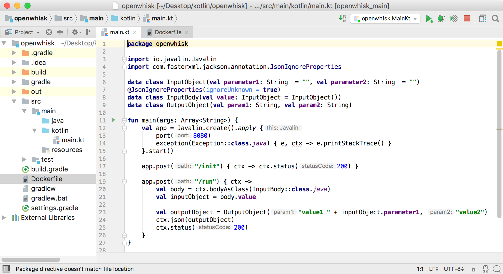

# Developing OpenWhisk Functions with Kotlin in IntelliJ

This [project](https://github.com/nheidloff/openwhisk-docker-kotlin) shows how [Apache OpenWhisk](http://openwhisk.org/) functions can be developed with [Kotlin](https://kotlinlang.org/). The Java code is built via Gradle and put into a Docker image which can be deployed to OpenWhisk cloud providers like the [IBM Cloud](https://bluemix.net).

There are different approaches to write OpenWhisk functions with Kotlin. Check out this [article](https://medium.com/openwhisk/serverless-kotlin-how-to-run-a-kotlin-action-on-openwhisk-3986963f2dd0) which describes how to generate a jar file which is directly deployed on OpenWhisk.

The approach taken in this project is slightly different. Rather than deploying a jar file to the [OpenWhisk Java runtime](https://github.com/apache/incubator-openwhisk-runtime-java), a Docker image that contains the jar file is used instead. The advantage of this approach is that it allows to use different Java versions and you can develop and test the same Docker image locally which is later deployed and run in the cloud. This minimizes the chances to run into issues because of different environments.

Here is a screenshot that shows the Kotlin code in IntelliJ:



## Prerequisites

In order to run the code you need the following prerequisites:

* [Java JDK](http://www.oracle.com/technetwork/java/javase/downloads/index.html)
* [IntelliJ IDEA Community](https://www.jetbrains.com/idea/download/)
* [Docker](https://docs.docker.com/engine/installation/)
* [git](https://git-scm.com/downloads)
* [Gradle](https://gradle.org/)
* [IBM Cloud account](https://ibm.biz/nheidloff)


## Setup

Open IntelliJ and import the project from the directory 'openwhisk-docker-kotlin/kotlin'.

In order to test the sample function locally, run these commands:

```sh
$ git clone https://github.com/nheidloff/openwhisk-docker-kotlin.git
$ cd openwhisk-docker-kotlin/kotlin
$ gradle build clean
$ cd ..
$ docker build -t openwhisk-docker-kotlin:latest .
$ docker run -p 8080:8080 --rm=true openwhisk-docker-kotlin:latest
$ curl --request POST \
  --url http://localhost:8080/run \
  --header 'Cache-Control: no-cache' \
  --header 'Content-Type: application/json' \  
  --data '{ "value": {"parameter1":"Niklas","parameter2":"Heidloff"}}'
```

## Deployment

In order to deploy the functions to IBM Cloud Functions, replace 'your-ibm-cloud-organization', 'your-ibm-cloud-space' and 'dockerhub-name' and run the following commands:

```sh
$ bx login -a api.ng.bluemix.net
$ bx target -o <your-ibm-cloud-organization> -s <your-ibm-cloud-space>
$ bx plugin install Cloud-Functions -r Bluemix
$ docker build -t <dockerhub-name>/openwhisk-docker-kotlin:latest .
$ docker push <dockerhub-name>/openwhisk-docker-kotlin
$ bx wsk action create actionDockerKotlin --docker <dockerhub-name>/openwhisk-docker-kotlin:latest
$ bx wsk action invoke --blocking actionDockerKotlin --param-file parameters.json
```

After you've changed the functions and created them on IBM Cloud Functions, use 'bx wsk action update' instead of 'bx wsk action create'.